# AICUP 2025 醫病語音敏感個人資料辨識競賽結果復現說明

## Environment

- OS: 
    ```bash
    NAME="Arch Linux"
    PRETTY_NAME="Arch Linux"
    ID=arch
    BUILD_ID=rolling
    ANSI_COLOR="38;2;23;147;209"
    HOME_URL="https://archlinux.org/"
    DOCUMENTATION_URL="https://wiki.archlinux.org/"
    SUPPORT_URL="https://bbs.archlinux.org/"
    BUG_REPORT_URL="https://gitlab.archlinux.org/groups/archlinux/-/issues"
    PRIVACY_POLICY_URL="https://terms.archlinux.org/docs/privacy-policy/"
    LOGO=archlinux-logo
    ```

- GPU: NVIDIA GeForce RTX 4090 * 1

- Download [Miniconda](https://www.anaconda.com/docs/getting-started/miniconda/install#linux-terminal-installer).

-  Run commands:
    ```bash
    conda env create -f env.yml
    conda activate aicup
    ```

## Task1: Automatic Speech Recognition

### Data Preprocessing

- ```merge_data.py```: Merge first phase and second phase trainsets. 

- ```stereo_to_mono.py```: Transform stereo wav files into mono in trainset/validset/testset for ASR model fine-tuning.

- ```{train, valid}/asr_finetune_dataset.py```: Read ```{train, valid}/task1_answer.txt``` and ```{train, valid}/audio/*.wav``` to create ```{train, valid}/asr_finetune_trainset.jsonl``` for model fine-tuning.
    
    - Only preserve English audio to finetune *[nvidia/parakeet-tdt-0.6b-v2](https://huggingface.co/nvidia/parakeet-tdt-0.6b-v2)*.
    
    - For Chinese ASR, we directly use *[andybi7676/cool-whisper](https://huggingface.co/andybi7676/cool-whisper)* without fine-tuning.

### Fine-Tuning

- Download *[nvidia/parakeet-tdt-0.6b-v2](https://huggingface.co/nvidia/parakeet-tdt-0.6b-v2)* and *[andybi7676/cool-whisper](https://huggingface.co/andybi7676/cool-whisper)*.

- ```asr_finetune/asr_finetune.sh```: Start fine-tuning.

    - ```asr_finetune/speech_to_text_finetune.yaml```: Save configurations such as *batch_size*, *learning_rate*, *max_epochs*...
    
    - ```asr_finetune/asr_finetune.py```: Fine-tuning code.
    
    - GPU consumption: 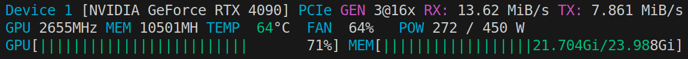
    
    - Time consumption and train/valid WER curves: 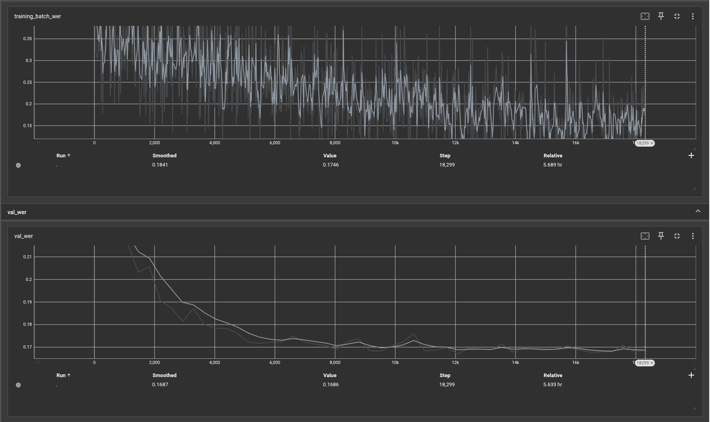

### Inference

- ```asr_generate_json_cw.py```: Generate a ```transcriptions.json``` with transcriptions and word level timesteps by *[andybi7676/cool-whisper](https://huggingface.co/andybi7676/cool-whisper)*.

- ```asr_correct_with_nemo.py```: Read ```transcriptions.json``` to detect English transcriptions/timesteps and regenerate them by *[nvidia/parakeet-tdt-0.6b-v2](https://huggingface.co/nvidia/parakeet-tdt-0.6b-v2)*. Finally, it will organize all transcriptions/timesteps and output a ```transcriptions_corrected.json``` along with ```task1_answer.txt``` for submission.

- Running times of all programs should be less than 10 mins with a NVIDIA GeForce RTX 4090.

## Task2: Named Entity Recognition

### Data Preprocessing

- ```{train, valid}/ner_finetune_dataset.py```: Read ```{train, valid}/task{1, 2}_answer.txt``` to create ```{train, valid}/ner_finetune_trainset_{ENTITY TYPES}.jsonl``` for model fine-tuning.

    - List ```specified_types_for_this_run``` saves entity types tagged in generated data.
    
    - Each LoRA adapter learns to tag entities listed in *specified_types_for_this_run*.

- ```{train, valid}/ner_finetune_trainset_MEDICAL_RECORD_NUMBER_ID_NUMBER.jsonl```: This example would be generated if ```specified_types_for_this_run = ['MEDICAL_RECORD_NUMBER', 'ID_NUMBER']```.
    
    - Input: ```This medical report pertains to XXXXX, identified by ID number 12S456789H with medical record 12345.ABC and Lab number 12E3456```.

    - Output: ```This medical report pertains to XXXXX, identified by ID number <ID_NUMBER>12S456789H</ID_NUMBER> with medical record <MEDICAL_RECORD_NUMBER>12345.ABC</MEDICAL_RECORD_NUMBER> and Lab number <ID_NUMBER>12E3456</ID_NUMBER>```.


### Fine-Tuning

- Download *[meta-llama/Llama-3.2-3B-Instruct](https://huggingface.co/meta-llama/Llama-3.2-3B-Instruct)*.

- ```ner_finetune/ner_fewshot_finetune.sh```: Start fine-tuning.

    - ```ner_finetune/ner_fewshot_finetune.py```: Fine-tuning code.

    - Before fine-tuning, train/valid dataset with corresponding entity types is needed. (ex. ```{train, valid}/ner_finetune_trainset_MEDICAL_RECORD_NUMBER_ID_NUMBER.jsonl``` is needed before you run ```python ner_fewshot_finetune.py --ner_types 'MEDICAL_RECORD_NUMBER' 'ID_NUMBER'```)

    - GPU consumption (6 LoRA adapters are trained with different set of entity types):

        - ```specified_types_for_this_run = ['PATIENT', 'DOCTOR', 'FAMILYNAME', 'PERSONALNAME']```: 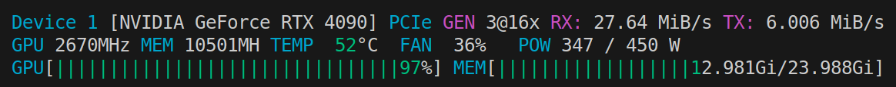

        - ```specified_types_for_this_run = ['PROFESSION']```: 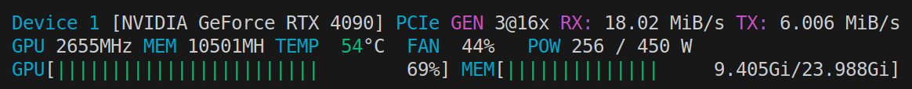

        - ```specified_types_for_this_run = ['ROOM', 'DEPARTMENT', 'HOSPITAL', 'ORGANIZATION']```: 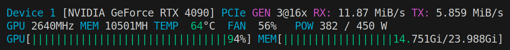

        - ```specified_types_for_this_run = ['STREET', 'CITY', 'DISTRICT', 'COUNTY', 'STATE', 'COUNTRY', 'ZIP', 'LOCATION-OTHER']```: 

        - ```specified_types_for_this_run = ['AGE', 'DATE', 'TIME', 'DURATION', 'SET']```: 

        - ```specified_types_for_this_run = ['MEDICAL_RECORD_NUMBER', 'ID_NUMBER']```: 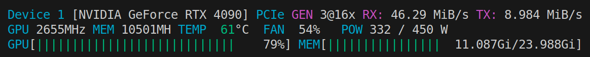

    - Time consumption and train/valid loss curves (plotted by GPT-4o): 
        - ```specified_types_for_this_run = ['PATIENT', 'DOCTOR', 'FAMILYNAME', 'PERSONALNAME']``` (40 mins): 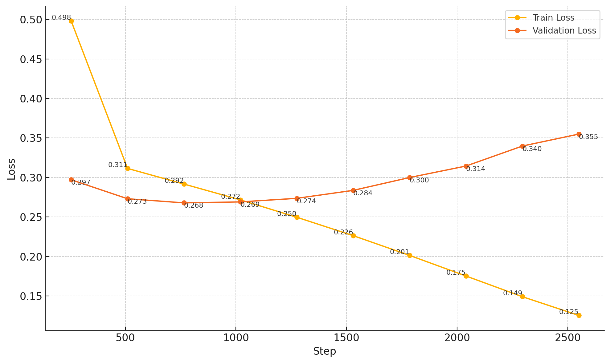

        - ```specified_types_for_this_run = ['PROFESSION']``` (5 mins): 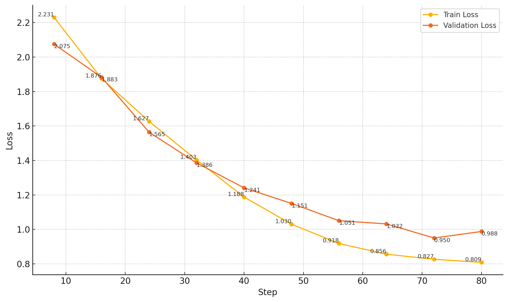

        - ```specified_types_for_this_run = ['ROOM', 'DEPARTMENT', 'HOSPITAL', 'ORGANIZATION']``` (6 mins): 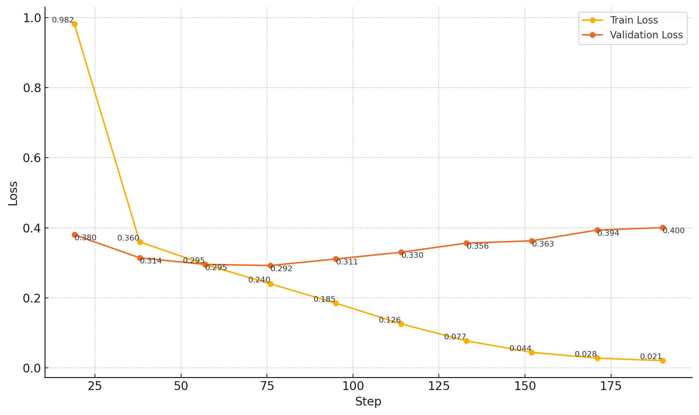

        - ```specified_types_for_this_run = ['STREET', 'CITY', 'DISTRICT', 'COUNTY', 'STATE', 'COUNTRY', 'ZIP', 'LOCATION-OTHER']``` (10 mins): 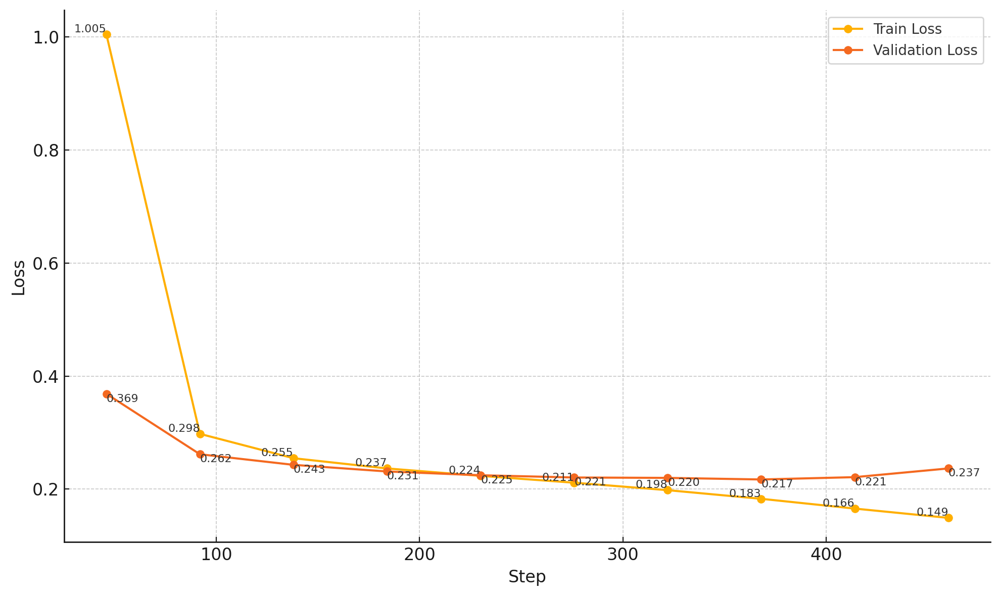

        - ```specified_types_for_this_run = ['AGE', 'DATE', 'TIME', 'DURATION', 'SET']``` (30 mins): 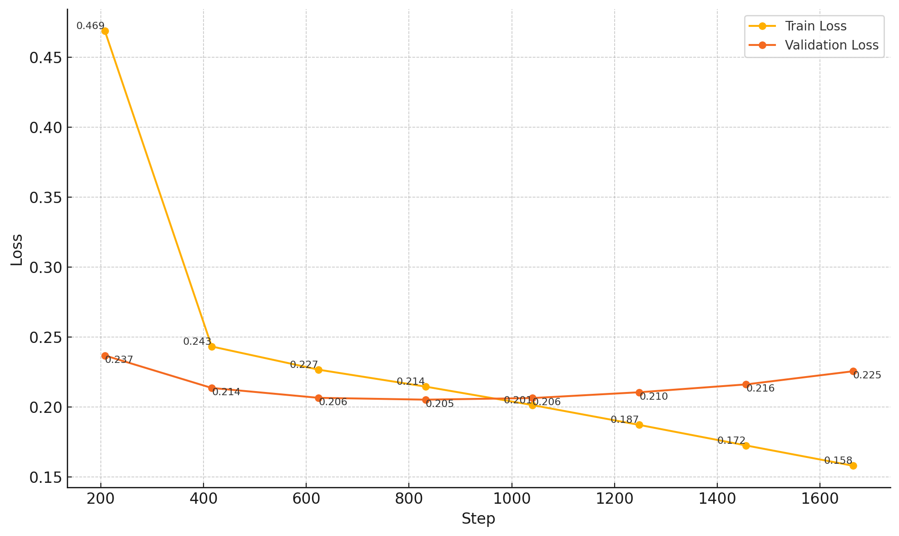

        - ```specified_types_for_this_run = ['MEDICAL_RECORD_NUMBER', 'ID_NUMBER']``` (5 mins): 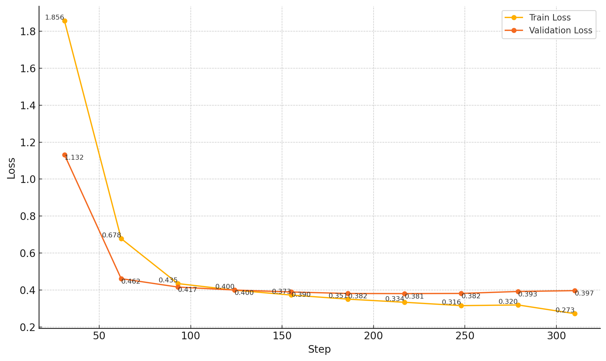

### Inference

- ```ner_inference.sh```: Generate multiple prediction files of task2 given LoRA adapters responsible for different set of entity types.
    
    - ```ner_inference.py```: Inference code.

    - ```adapter_step``` is chosen to be the checkpoint with lowest valid loss during fine-tuning.

- Running times of all programs should be less than 10 mins with a NVIDIA GeForce RTX 4090.

- Copy and paste all subprediction files into a complete task2 prediction file.

- ```merge_ner.py```: Extract predictions of specific entity type from source file and use them to replace predictions of the same entity type in base file. (for ensemble of models tuned by different configurations.)

## References

- Most of programs are completed together with *o4-mini-high* and *Gemini-2.5-pro*.
- https://docs.nvidia.com/nemo-framework/user-guide/latest/nemotoolkit/asr/datasets.html
- https://docs.nvidia.com/nemo-framework/user-guide/latest/nemotoolkit/asr/configs.html
- https://discuss.huggingface.co/t/loading-list-as-dataset/35109
- https://huggingface.co/docs/trl/sft_trainer
- https://github.com/linkedin/Liger-Kernel
- https://github.com/bitsandbytes-foundation/bitsandbytes